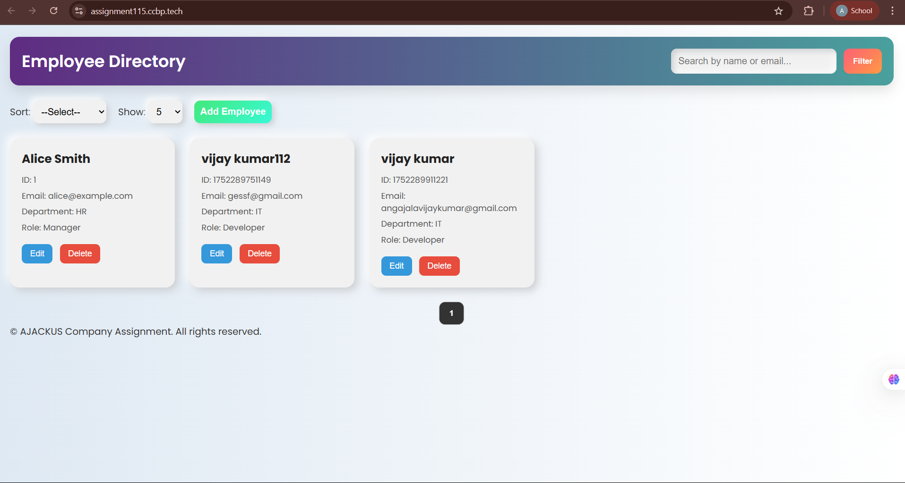
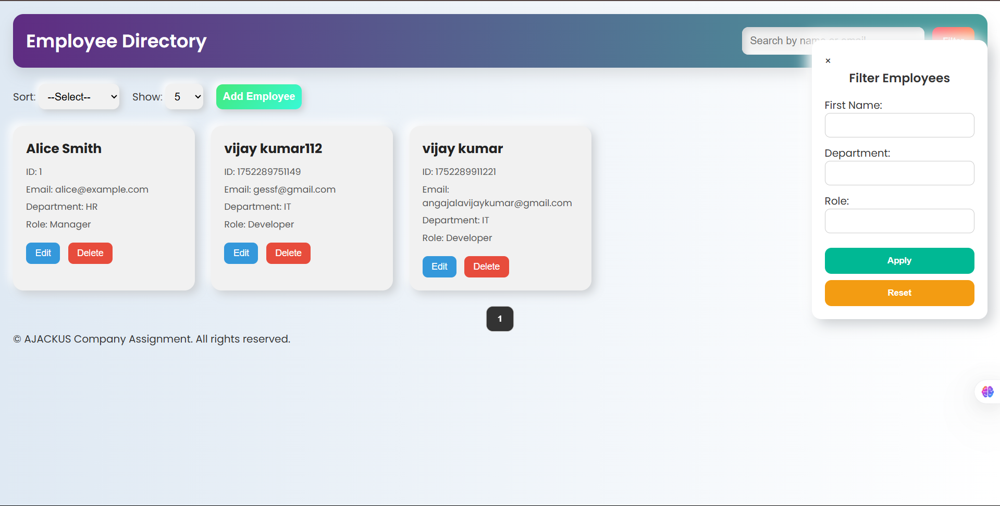
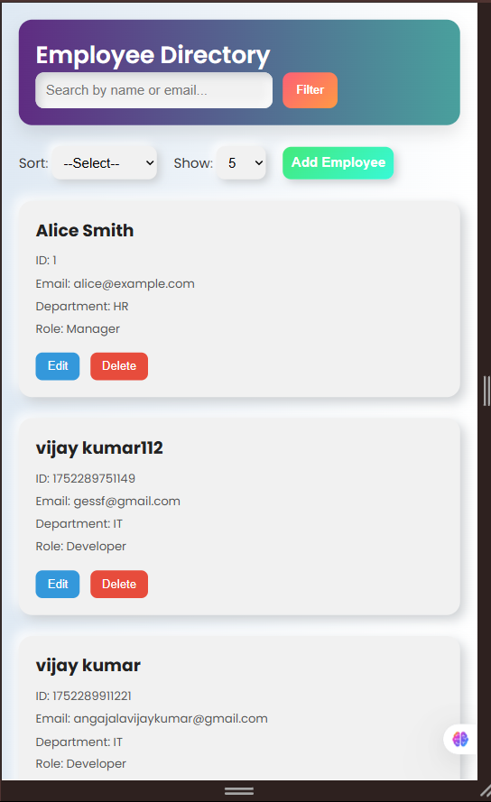
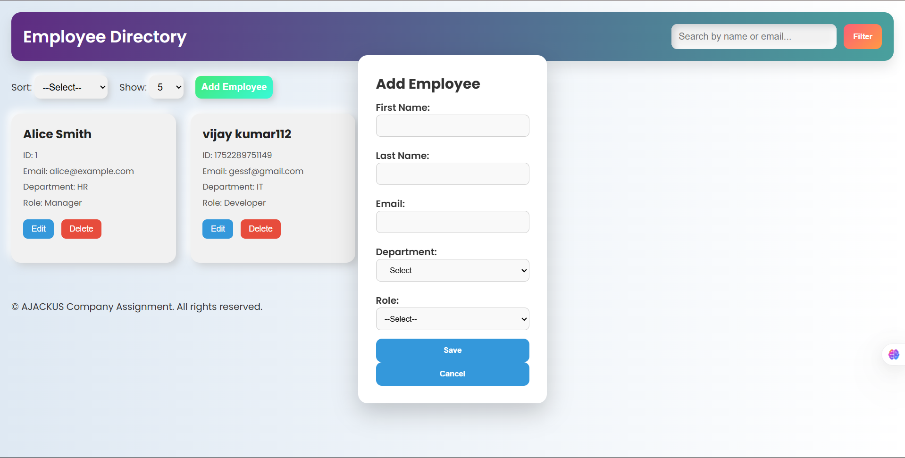

# 👥 Employee Directory Web Interface

A responsive and interactive Employee Directory built with **HTML**, **CSS**, **Vanilla JavaScript**, and **Freemarker Templates**. This project was built as part of the AJACKUS technical assignment.

---

## 📂 Project Structure

```
src/main/resources/
├── static/
│   ├── css/
│   │   └── style.css
│   └── js/
│       ├── app.js
│       └── data.js
├── templates/
│   └── index.html or index.ftlh
```

---

## ⚙️ Setup Instructions

> 📌 No server is required. You can open the `index.html` directly in your browser if simulating Freemarker. If using Freemarker in a Java backend, place templates and run via Spring Boot or equivalent setup.

1. Clone the repository:
   ```bash
   git clone https://github.com/your-username/employee-directory.git
   cd employee-directory
   ```

2. Open `index.html` directly in any browser.

3. All data is mocked and handled on the frontend (in-memory array).

---

## 🧩 Core Features

- ✅ View Employee Directory
- ✅ Add New Employee
- ✅ Edit Existing Employee
- ✅ Delete Employee
- ✅ Search by Name or Email
- ✅ Filter by Department & Role
- ✅ Sort by First Name / Department
- ✅ Responsive UI (Mobile, Tablet, Desktop)
- ✅ Pagination (Select: 10 / 25 / 50 / 100 per page)
- ✅ Form Validations (Required fields + Email format)

---

## 📸 Screenshots

### 🔹 Dashboard View (Desktop)


### 🔹 Add/Edit Form


### 🔹 Responsive Mobile View


### 🔹 Filter & Search


---

## 📝 Technical Details

- **HTML**: Semantic structure using appropriate tags.
- **CSS**: Responsive design with Flexbox and media queries.
- **JavaScript**: Modular, clean logic with event-driven DOM updates.
- **Freemarker**: Used to simulate server-side data injection (can run via Spring Boot if needed).
- **Data**: Mock employee list stored in `data.js`.

---

## 🧠 Reflection

### 🚧 Challenges Faced:
- Managing state transitions between list and form view without a framework.
- Handling dynamic filters and sort combinations.
- Implementing pagination logic in sync with filtered/sorted results.

### 💡 Improvements:
- Integrate browser storage (e.g., localStorage) to persist data.
- Add profile image support for employees.
- Include unit tests for key JS logic.
- Support infinite scroll for smoother UX.

---

## 📜 License

This project is for assignment purposes and shared under [MIT License](LICENSE).

---

## 🤝 Contributing

Pull requests are welcome! If you'd like to enhance the UX or introduce new filters, feel free to fork the repo and raise a PR.
